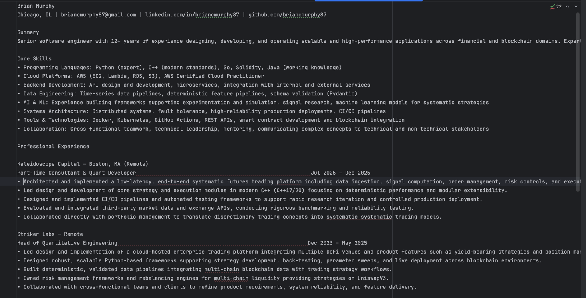
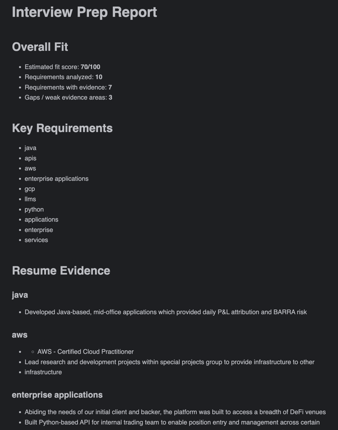

# Interview Prep Agent

A lightweight AI agent that generates **targeted resumes for specific job descriptions** using prior resume examples and automatically produces a detailed **fit and quality evaluation report**.

The system demonstrates a practical architecture used in real AI systems:

- Retrieval-augmented generation
- Tool-based agent loops
- Deterministic evaluation pipelines
- LLM-as-judge artifact evaluation
- Reproducible batch evaluation harness

---

# Overview

Given:

- a **target job description**
- a **raw base resume**
- a **corpus of previously tailored resumes**

the agent:

1. Extracts the most important job requirements
2. Retrieves similar examples from the resume corpus
3. Generates a **targeted resume**
4. Scores how well the resume fits the job
5. Uses an **LLM-based evaluator** to critique the resume
6. Produces a detailed **review report**

---

# Example Output

## input
```shell    
--jd
job_specs/netflix_swe5.txt
--resume
resume_corpus/raw_resume.txt
--corpus
resume_corpus
--out-resume
job_specs/netflix_swe5.targeted_resume.txt
--out-report
job_specs/netflix_swe5.report.md
```

## output 1 - targeted resume

will output the file here: 


screenshot: 



## output 2 - role fit and resume evaluation report
will output the file here: 


screenshot: 



# Example Workflow

```
job description
       +
raw resume
       +
resume corpus
       ↓
agent retrieves similar resume examples
       ↓
generate targeted resume
       ↓
fit analysis
       ↓
LLM resume evaluation
       ↓
final report
```

Outputs:

```
targeted_resume.txt
resume_review_report.md
```

---

# Project Structure

```
src/
  agent.py          CLI entry point (single job run)
  agent_loop.py     agent orchestration loop
  agent_state.py    shared state object
  llm.py            LLM wrapper
  tools.py          agent + evaluation tools
  run_evals.py      batch evaluation harness

resume_corpus/
  raw_resume.txt
  google_cloud_ai_ml/
  netflix_swe_n_tech/
  ...

evals/
  cases/
    netflix_swe_n_tech/
      jd.txt
      raw_resume.txt
      expected_requirements.json
    google_cloud_ai_ml/
      ...
    databricks_ml_ai_finserv/
      ...
  outputs/            per-case artifacts written here at runtime
  summaries/          aggregate summary JSONs written here at runtime
```

---

# Key Concepts Demonstrated

## Agent + Tool Architecture

The agent does not directly generate everything.

Instead it decides which tools to call:

- `load_resume_corpus`
- `extract_jd_requirements`
- `retrieve_similar_resume_examples`
- `generate_target_resume`

This keeps reasoning separated from implementation.

---

## Retrieval-Augmented Resume Generation

Instead of generating a resume from scratch, the agent retrieves relevant examples from a **resume corpus**.

This dramatically improves the quality of the generated resume.

---

## Deterministic Evaluation Pipeline

After the resume is generated, Python code performs:

- requirement matching
- evidence extraction
- fit scoring

This ensures evaluation remains reproducible and explainable.

---

## LLM-as-Judge Evaluation

A second LLM pass evaluates the generated resume across multiple dimensions:

- JD alignment
- keyword coverage
- clarity
- exaggeration risk
- ATS compatibility

This produces structured critique and suggested improvements.

---

## Batch Evaluation Harness

`src/run_evals.py` runs the full pipeline across multiple eval cases and aggregates results into a single summary.

Each eval case lives under `evals/cases/<slug>/` and contains:

- `jd.txt` — the target job description
- `raw_resume.txt` — the base resume input
- `expected_requirements.json` — optional keyword expectations used for pass/fail validation

The summary reports:

| Metric | Description |
|---|---|
| `average_overall_score` | Mean LLM evaluator overall score across cases |
| `average_jd_alignment` | Mean JD alignment score |
| `average_keyword_coverage` | Mean keyword coverage score |
| `average_exaggeration_safety` | Mean exaggeration safety score (higher = safer) |
| `average_ats_compatibility` | Mean ATS compatibility score |
| `average_fit_score` | Mean deterministic fit score |
| `retrieval_hit_rate` | Fraction of cases where corpus retrieval returned ≥1 match |
| `num_failed` | Cases that raised an uncaught exception |

This turns the project from "I built an agent" into "I built and evaluated an AI workflow with reproducible cases."

---

# Installation

Create a virtual environment:

```
python -m venv .venv
source .venv/bin/activate
```

Install dependencies:

```
pip install -r requirements.txt
```

Set your OpenAI API key:

```
export OPENAI_API_KEY="your_api_key_here"
```

---

# Usage

## Single job run

```
python -m src.agent \
  --jd job_specs/netflix_swe5.txt \
  --resume resume_corpus/raw_resume.txt \
  --corpus resume_corpus \
  --out-resume job_specs/netflix_swe5.targeted_resume.txt \
  --out-report job_specs/netflix_swe5.report.md
```

Outputs:

```
job_specs/netflix_swe5.targeted_resume.txt
job_specs/netflix_swe5.report.md
```

## Batch evaluation

Run all cases under `evals/cases/` and write outputs + a summary:

```
python -m src.run_evals \
  --eval-dir evals/cases \
  --out-dir  evals/outputs \
  --corpus   resume_corpus \
  --model    gpt-4.1-mini
```

Per-case outputs are written to `evals/outputs/<case_slug>/`:

```
target_resume.txt       tailored resume for that case
report.md               full fit + evaluation report
requirements.json       extracted JD requirements
retrieved_examples.json corpus retrieval results
evaluation.json         LLM evaluator scores and feedback
run_metadata.json       timing, tool counts, notes, validation result
```

A summary JSON is written to `evals/summaries/summary_<timestamp>.json` with aggregate metrics across all cases.

---

# Example Output Artifacts

### Targeted Resume

A rewritten resume tailored for the specific job description.

### Review Report

Includes:

- extracted job requirements
- resume evidence snippets
- fit analysis
- missing requirements
- LLM quality evaluation
- improvement suggestions

---

# Why This Project Exists

Many AI demos stop at generation.

Real systems require:

- retrieval
- structured reasoning
- evaluation pipelines
- automated critique

This project demonstrates how those pieces fit together in a practical workflow.

---

# Possible Extensions

Future improvements could include:

- automatic resume revision loops based on evaluator feedback
- vector search for corpus retrieval (replacing keyword overlap)
- ATS keyword optimization
- resume diff visualization
- recruiter-style scoring rubrics
- automatic cover letter generation
- trend analysis across eval summary runs to track prompt improvements over time

---

# Disclaimer

Job descriptions included in this repository are publicly available postings used solely for demonstration purposes.

Company names may be anonymized in some cases.
